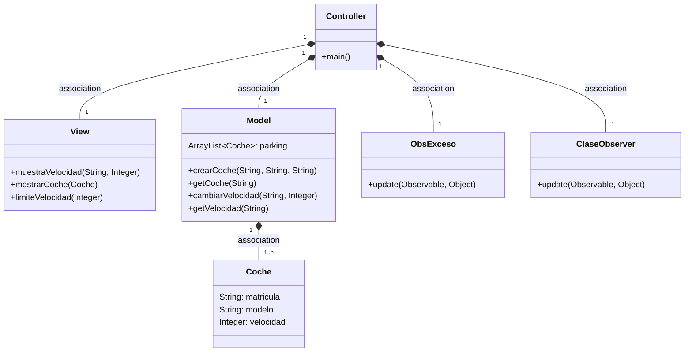
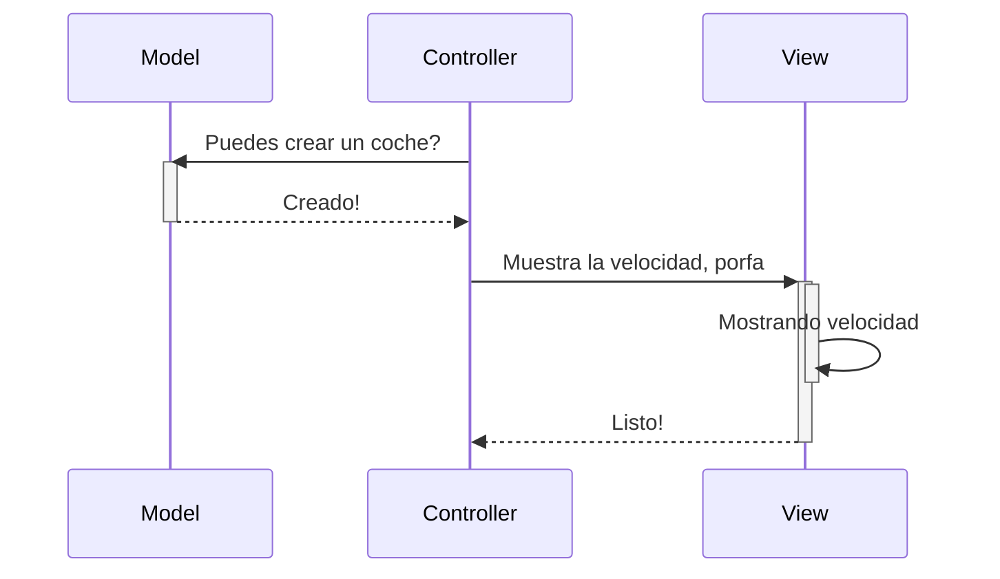
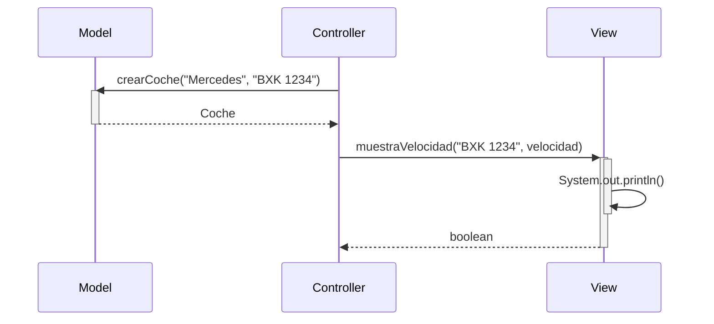
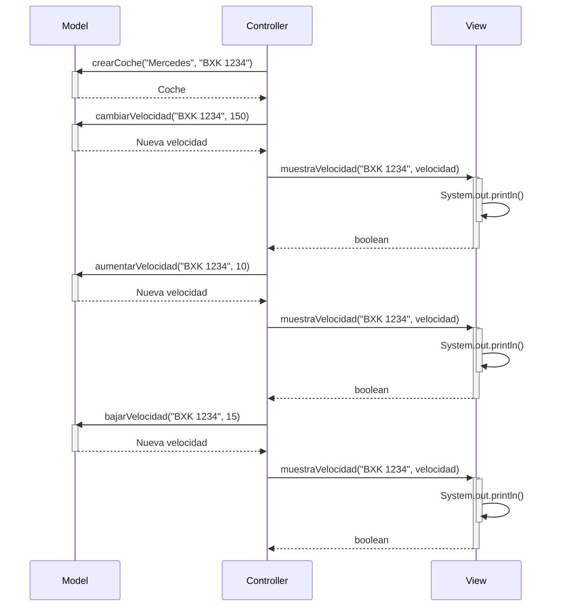

# Arquitectura MVC

Aplicación que trabaja con objetos coches, modifica la velocidad y la muestra

---
## Diagrama de clases:

---

## Diagrama de Secuencia

Ejemplo básico del procedimiento, sin utilizar los nombres de los métodos

El mismo diagrama con los nombres de los métodos

Diagrama ejemplo aumentarVelocidad y bajarVelocidad

# Nueva función buscar coches

---

####  Función añadida al programa de coches

Ahora se pueden buscar coches creados por su matricula usando el nuevo boton implementado en la UI

### Pasos para la implementacion de la nueva función

+ Crear metodo mostrarCoche en View, que recibe un objeto de coche y lo muestra.
+ Crear un metodo buscarCoche en Controller que llame a getCoche (metodo de Model), y al nuevo metodo mostrarCoche.
+ Añadir boton Mostrar Coche a la IU, que llama al metodo buscarCoche del Controller.

# Nueva función limite de velocidad excedida

---

### Pasos seguidos para implementar la nueva función

+ Se crea clase ObsExceso, que revisa que la velocidad no exceda 120 km/h.
+ Se crea metodo de dialogo para generar dialogos de alerta.
+ Se crea metodo en View para avisar de velocidad excedida con una alerta.
+ Se añade observer de tipo ObsExceso a la clase Controller.